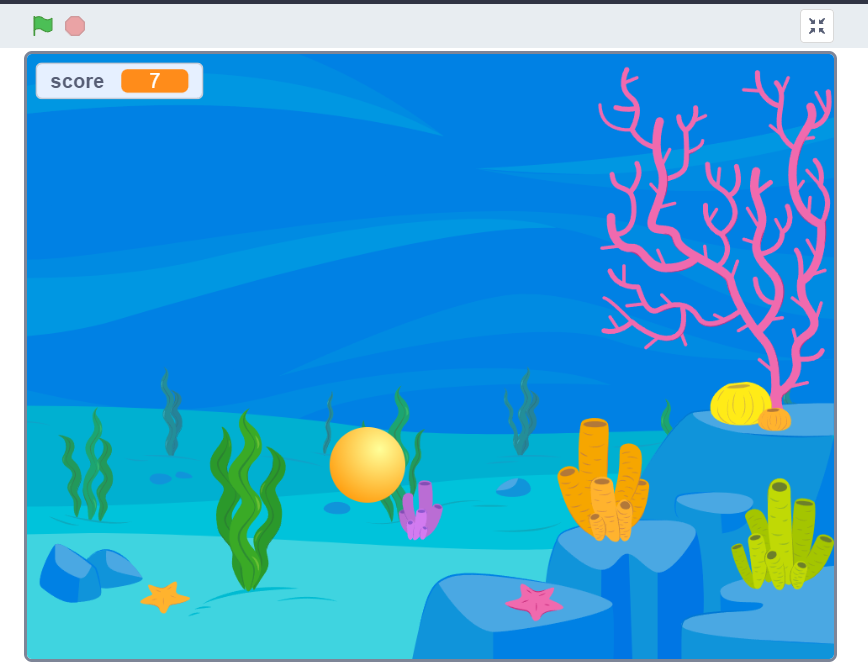
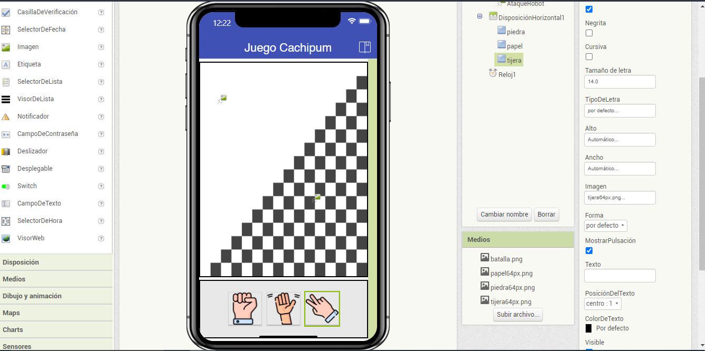

# Juegos con scrackt
## para aprender scratch

### Link de la pagina 
<a href="https://scratch.mit.edu/"> Scratch <a>

## Link de mi videojuego creado

https://scratch.mit.edu/projects/876900910

### imagen del juego 

<iframe src="https://scratch.mit.edu/projects/876900910/embed" allowtransparency="true" width="485" height="402" frameborder="0" scrolling="no" allowfullscreen></iframe>

## app de cachipum que hice  en elementor inventor 
### link 
<a href="https://appinventor.mit.edu/"> https://appinventor.mit.edu/ </a>
